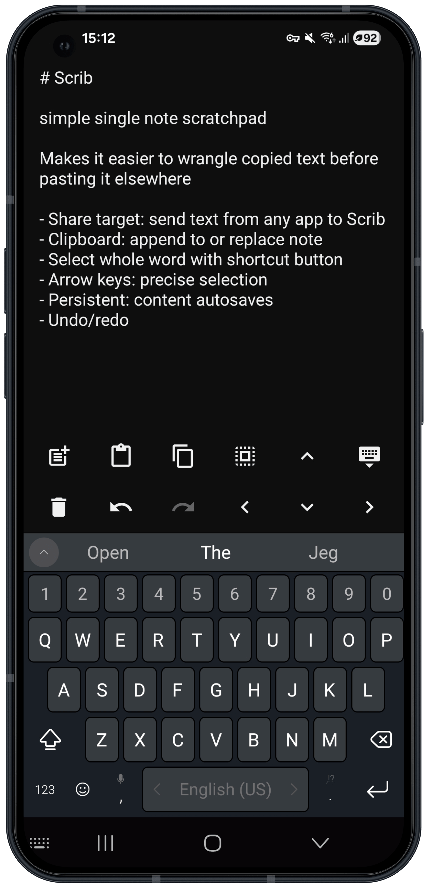

# Scrib

A simple text workspace for Android. Copy messy text in, clean it up, copy out what you need, with shortcut keys and arrow key helpers to simplify precise selection.

Typical use: you copy a message containing a phone number. Share it to Scrib, tap the number, hit copy. Done.

## Features

- **Share target** — receive text directly from any app, trailing URLs stripped automatically
- **Clipboard actions** — append or replace note content from clipboard; copy selection or full text in one tap
- **Word selection** — select the word at the cursor in one tap
- **Cursor navigation** — move left, right, up, down via bottom bar buttons
- **Persistent** — note and full undo history survive app restarts




## Requirements

Android 7.0 (API 24) or higher.

## Build

```bash
./gradlew assembleDebug
```

## License

Licensed under the [Apache License 2.0](LICENSE).
