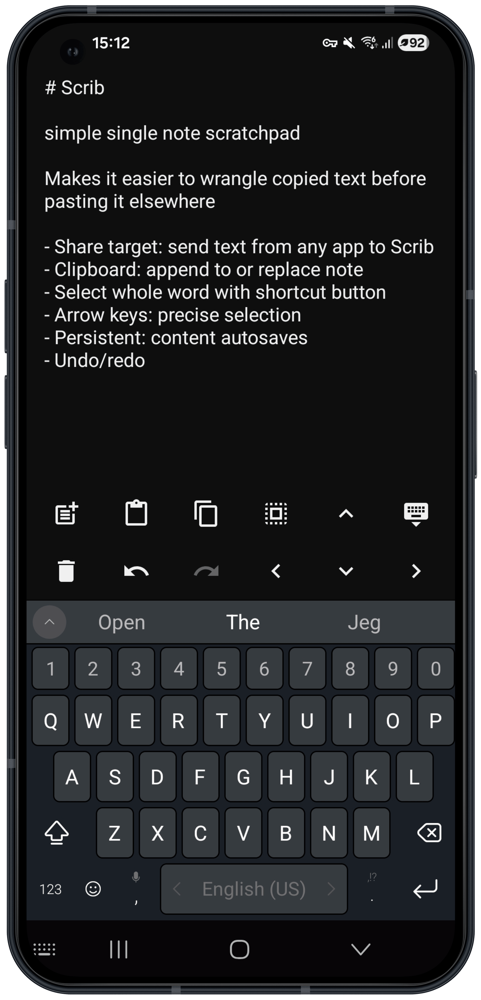

# Scrib

A simple text workspace for Android. Copy messy text in, clean it up, copy out what you need, with shortcut keys and arrow key helpers to simplify precise selection.

Works well for things like extracting a phone number from a wall of text: share to Scrib, tap the number, copy.

## Features

- **Share target**: receive text directly from any app, trailing URLs stripped automatically
- **Clipboard actions**: append or replace note content from clipboard; copy selection or full text in one tap
- **Word selection**: select the word at the cursor in one tap
- **Cursor navigation**: move left, right, up, down via bottom bar buttons
- **Move lines**: swipe up off the Up button, or down off Down, to shift the current line
- **Quick Settings tile**: send clipboard text to the note straight from the shade
- **Button previews**: hold a bar button to see what it does before letting go
- **Persistent**: note and full undo history survive app restarts




## Install

[F-Droid](https://f-droid.org/packages/dev.thaulow.scrib/), or grab the APK from [releases](https://github.com/stianthaulow/scrib/releases/latest).

## Requirements

Android 7.0 (API 24) or higher.

## Build

```bash
./gradlew assembleDebug
```

## License

Licensed under the [Apache License 2.0](LICENSE).
